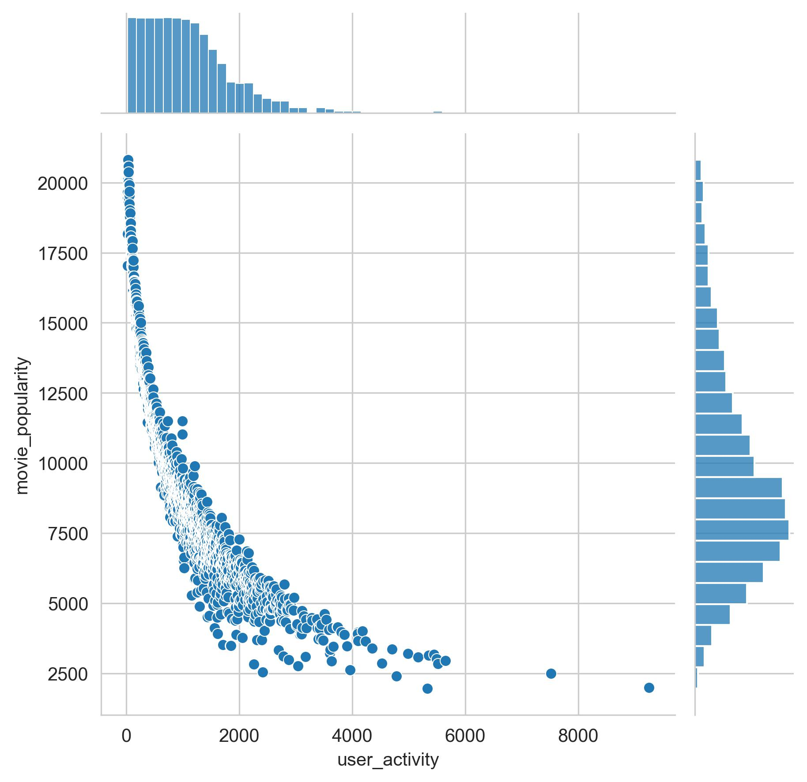
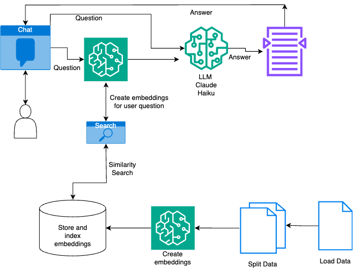
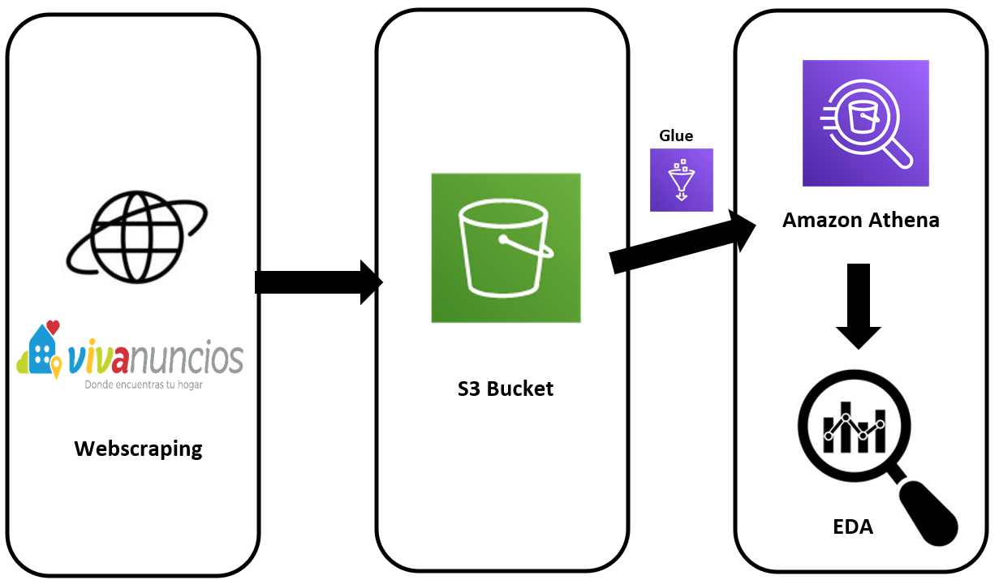

# My Projects by Roberto Calzadilla

## [ML PROJECT - RECOMMENDATION SYSTEM](https://roberto121c.github.io/Recommendation_System/)

### Project overview
* Developed a movie recommendation system using matrix factorization techniques.
* Compared two methods: Regularized Least Squares implemented from scratch versus SVD using the Surprise library.
* The scratch-built model slightly outperformed the library-based model, but its higher complexity to made it less practical and reliable.

You can access to it **[HERE](https://roberto121c.github.io/Recommendation_System/)**

  

## [RAG PROJECT - TRAFFIC REGULATIONS CHATBOT](https://roberto121c.github.io/Traffic_Regulations_Chatbot/)

### Project overview
* Developed a chatbot application to help users to clarify questions about Mexico City's traffic regulations
* Leveraged LangChain, AWS Bedrock, and OpenSearch for the backend infrastructure.
* Implemented the Retrieval-Augmented Generation methodology, using Titan for embeddings and Claude Haiku as the Language Model.

You can access to it **[HERE](https://roberto121c.github.io/Traffic_Regulations_Chatbot/)**

  

## [DATA ENGINEERING PROJECT - HOUSE PRICES](https://roberto121c.github.io/House_prices/)

### Project overview
* Developed a complete ETL process using different technologies (Pyspark, beatifulsoup, AWS, sklearn)
* Scraped information from a real state webpage, the crude data is stored in S3
* Cleaned the data with AWS Glue and pyspark, then loaded it to Athena SQL
* Finally did EDA and model a linear regression to calculate the missing data about total area

You can access to it **[HERE](https://roberto121c.github.io/House_prices/)**

## [DATA ANALYSIS PROJECT - SALES MANAGEMENT](https://roberto121c.github.io/Sales_Management/)

### Project overview
* This projec explores different business metrics and how they can be displayed graphically to follow them
* I explore the relation between sales, budget, costumers and products
* We can obtain conclusions that will help us to make better marketing campaigns and improve profits
* The tools used are SQL server and Power BI

You can access to it **[HERE](https://roberto121c.github.io/Sales_Management/)**

## [EXCEL DATA ANALYSIS PROJECT](https://roberto121c.github.io/Excel_Analysis_Project/)

### Project overview
* An electronics store needs to increase its profits
* A KPI is found that will allow to increase profits at the lowest cost.
* Sales were evaluated by product, city, time and over time.
* This analysis was done on a database with 180,000 values using Excel only.

You can access to it **[HERE](https://roberto121c.github.io/Excel_Analysis_Project/)**

## [PYTHON - BANK LOANS ANALYSIS](https://roberto121c.github.io/Bank_loans_analysis/)

### Project overview
- We need to know which factors influence to give a loan
- We also need to look for any opportunity to increase the bank's assets.
- It was found that apart from income, family size is an important factor to give loans.
- The libraries used were pandas, numpy, matplotlib, seaborn and scipy.

You can access to it **[HERE](https://roberto121c.github.io/Bank_loans_analysis/)**

