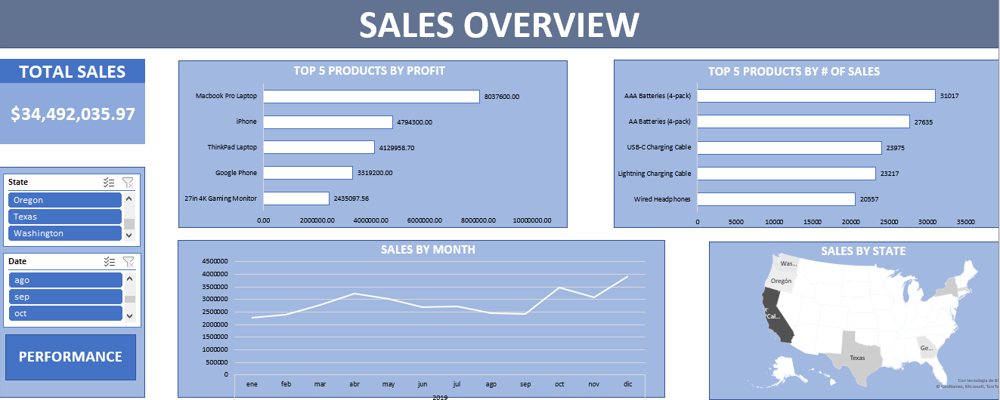

# My Projects by Roberto Calzadilla

## [DATA ANALYSIS PROJECT - SALES MANAGEMENT](https://roberto121c.github.io/Sales_Management/)

### Project overview
* This projec explores different business metrics and how they can be displayed graphically to follow them
* I explore the relation between sales, budget, costumers and products
* We can obtain conclusions that will help us to make better marketing campaigns and improve profits
* The tools used are SQL server and Power BI

You can access to it **[HERE](https://roberto121c.github.io/Sales_Management/)**

## [EXCEL DATA ANALYSIS PROJECT](https://roberto121c.github.io/Excel_Analysis_Project/)

### Project overview
* An electronics store needs to increase its profits
* A KPI is found that will allow to increase profits at the lowest cost.
* Sales were evaluated by product, city, time and over time.
* This analysis was done on a database with 180,000 values using Excel only.

You can access to it **[HERE](https://roberto121c.github.io/Excel_Analysis_Project/)**

